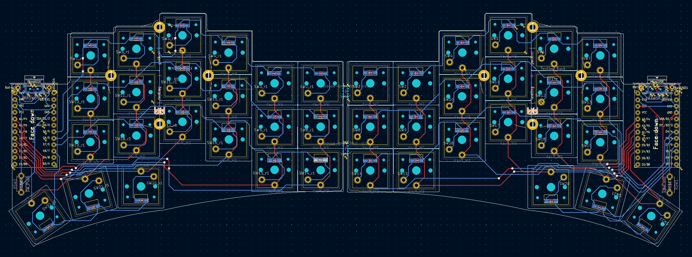

# Swept Corne

## What is the swept corne?

The Swept Corne is a mix between the [Sweep](https://github.com/davidphilipbarr/Sweep) (which is itself a version of the [Ferris](https://github.com/pierrechevalier83/ferris)) and the [Corne](https://github.com/foostan/crkbd).

## Motivation

I made the jump from a 60% qwerty keyboard to colemak mod-dh on a sweep. After getting up to speed both with the new layout and form factor I realized that to reach peak productivity I'd need a few more keys and the corne was the obvious choice but the non-choc spacing,
lack support for a power switch and the less aggresive staggering made me miss the sweep, so I decided to take the sweep as a starting point and add the extra keys by keeping it wireless friendly. The [Corne-is Zen](https://lowprokb.ca/products/corne-ish-zen) has similar
goals but up to this point has only been available through group buys and is closed source.

## What are the different types?

There's currently only one version of the swept with choc spacing as well as an on-off switch and no TRRS connector, this is to have the reset switch in a more comfortable position.

## Components list

To build and use a Swept you will need

* 1x PCB Kit (Instructions on how to order below).
* 2 nice!nanos. [Typeractive](https://typeractive.xyz/) has good prices, as well as fast shipping and processing.
* 2 batteries. From [Typeractive](https://typeractive.xyz/products/lithium-battery-110mah).
* 2 Mill-Max sockets with pins. Make sure you get the high-profile ones, low-profile still fits a battery underneath but there's less space. [Typeractive](https://typeractive.xyz/products/machine-sockets-and-pins) carries the correct size.
* 42 Choc v1 switches. You can get them from [MKUltra](https://mkultra.click/choc-switches).
* 84 Mill-Max 3305 or 7305 sockets, you can get either model from [prevailkey](https://prevailkeyco.com/products/3305-mill-max-sockets?variant=42568596193534). These are optional but you can use them to make your board hot-swap. I recommend getting some extra ones because they're very easy to lose.
* 42 smd diodes. From [MKUltra](https://mkultra.click/diode-1n4148-sod-123f/) for flush SOD-123F form factor, or from [Boardsource](https://boardsource.xyz/store/5ec9fc5d64caf04f83aa646c) for glass smd form factor; the former ones might be easier to solder for some people. I recommend getting some extra ones because they're very easy to lose.
* 42 keycaps. You can get them from [MKUltra](https://mkultra.click/mbk-choc-keycaps) or [Boardsource](https://boardsource.xyz/store/5f6ef2d68e3bf05ab838f918). I recommend getting a least a couple of homing keys, available from both providers.
* 2x reset switches ([B3U-1000P(M)](https://github.com/davidphilipbarr/Sweep/issues/20)). [This kit](https://www.amazon.com/dp/B07LCBLB8N?psc=1&ref=ppx_yo2ov_dt_b_product_details) includes switches that fit.
* Rubber feet, [these](https://www.amazon.com/dp/B07CNQC695?psc=1&ref=ppx_yo2ov_dt_b_product_details) work great.
* 2x power switches. [these](https://www.amazon.com/Gikfun-Switch-Toggle-Arduino-AE1073/dp/B01GFFGA4I/ref=psdc_495324_t1_B07SJWWYZP) work great.
* 1 USB C cable.

Note: All purchase links are for the US, PRs with links for other countries are welcome.

## Ordering The PCB

To order the PCB the following settings are recommended: 

|Detail|Value|
|---|---|
|Gerber file|`Swept_vX.zip`|
|Base material|FR-4|
|Layers|2|
|Dimension|261.1 mm * 90.7 mm|
|Different design|2|
|Delivery format|Panel by customer|
|PCB thickness|1.6mm|
|PCB color|(Personal preference)|
|Silkscreen|(Personal preference)|
|Surface finish|(Personal preference)|
|Outer copper weight|1oz|
|Gold Fingers|No|
|Confirm production file|No|
|Castellated holes|No|
|Remove order number|Yes|

Find the different versions on the releases page.

1: Settings are for [JLCPCB](https://jlcpcb.com/), but could work for other manufacturers.

2: Settings are taken from [Kyek's video guide](https://www.youtube.com/watch?v=fBPu7AyDtkM&t=17s).

## How do I make this thing?

Build video coming soon.

## Firmware

Firmware for zmk and nice!nano is called ["Corne"](https://zmk.dev/docs/hardware/).

## Changelog

### v0.1.1 (Recommended version)

Still untested.

- Deleted extra holes from the switch footprint which might be causing mnufacturers to charge extra.

### v0.1

First version, still untested.

Differences from the original Sweep:
- Added an extra pinky column.
- Added an extra thumb key.
- Converted from direct to switch connections to matrix with diodes keeping compatibility with the corne.

## Who made this?

* [AYM1607](https://github.com/AYM1607)
